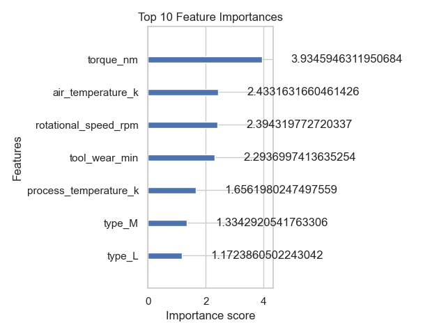
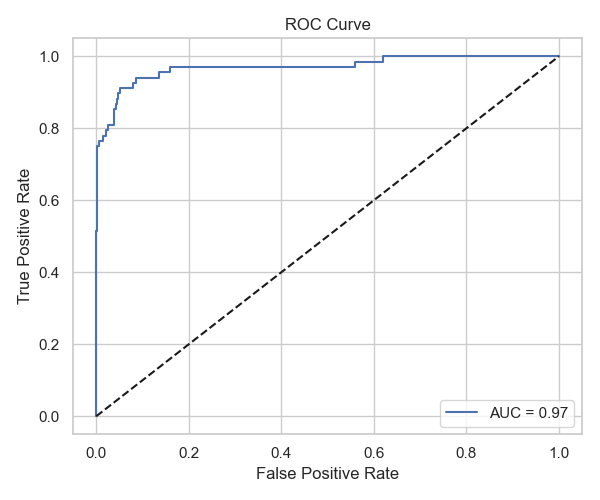
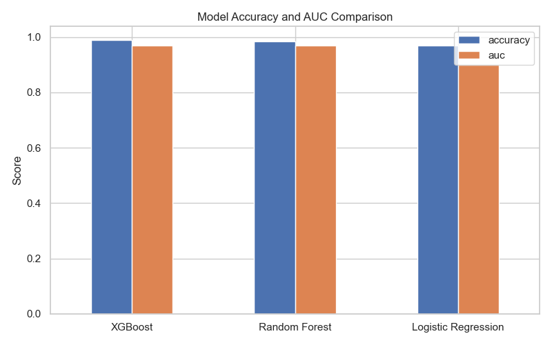

# 🏭 Predictive Maintenance with Machine Learning

A real-world predictive maintenance system built using industrial sensor data, applying classification algorithms and SHAP explainability to predict machine failures before they occur.

---

## 📈 Project Snapshots


### 🔍 SHAP Feature Importance


### 🧠 Top 10 XGBoost Features


### 📊 ROC Curve


### 🤖 Model Comparison


---

## 📖 Detailed Project Walkthrough

This project simulates a **real-world predictive maintenance scenario**, where we’re given sensor readings from machines and asked to **predict future failures**.

---

### 🧼 Step 1: Data Understanding & Cleaning

* Dataset: `10,000` machine logs with real-time telemetry and status flags
* Dropped identifiers (`UDI`, `Product ID`) to avoid leakage
* One-hot encoded `Type` column (machine type)
* Converted all object features to numerical or categorical
* Target: `Target` column indicating failure (binary classification)

---

### 📊 Step 2: Exploratory Data Analysis (EDA)

* ⚠️ **Highly imbalanced** data (\~2% failure rate), mimicking real industry conditions
* 🧩 `Failure Type` mostly `"No Failure"` → confirmed that `Target` is the modeling label
* 📊 **Correlation analysis**:

  * `Tool Wear`, `Torque`, and `Speed` positively correlated with failure
  * `Air Temp` ↔ `Process Temp` showed multicollinearity
* 🔍 Outlier inspection revealed high-risk wear patterns on failing machines

---

### 🤖 Step 3: Model Training (XGBoost)

Used **XGBoostClassifier** — ideal for tabular + imbalanced data

**Evaluation metrics**:

* ✅ Accuracy
* ✅ Precision
* ✅ **Recall** (priority: catching all failures)
* ✅ F1-score
* ✅ AUC-ROC

📌 **Recall stayed high**, meaning the model successfully detected most at-risk machines — crucial in predictive maintenance.

---

### 🧠 Step 4: Model Explainability (SHAP)

SHAP (SHapley Additive exPlanations) was used to interpret the model:

* `Tool Wear`, `Torque`, and `Rotational Speed` were the **most influential features**
* SHAP values showed that **higher tool wear** strongly pushes the model to predict failure
* Categorical encodings (machine `Type`) had minor but consistent influence

---

### 🔍 Step 5: Insights & Recommendations

📌 **Engineering Takeaways**:

* Set preventive thresholds for `Tool Wear` & `Torque`
* Enable real-time dashboards using SHAP to show *why* a machine was flagged
* Different machine types may require tailored maintenance cycles
* Flag borderline cases early to prevent false negatives

---

## 💾 Folder Structure

```
predictive-maintenance/
├── data/
│   └── pdm_dataset.csv
├── outputs/
│   ├── shap_summary_bar.png
│   ├── feature_importance.png
│   └── confusion_matrix.png
├── src/
│   └── preprocessing.py
├── venv/
├── requirements.txt
└── predictive_maintenance.ipynb
```

---

## 🧪 Requirements

```bash
pip install -r requirements.txt
```

Libraries used:

* `pandas`, `numpy`, `matplotlib`, `seaborn`
* `scikit-learn`, `xgboost`, `shap`

---

## 🧠 Why This Project Matters

* 📉 Demonstrates how to handle **imbalanced classification**
* 🛠 Applies **SHAP** for explainability — crucial in enterprise ML
* 🧪 Focused on **reliability + interpretability**, not just raw accuracy
* 🔁 End-to-end workflow: EDA → Modeling → Explainability → Actionable Insights

This project shows I can design trustworthy, interpretable models ready for production use — skills vital in both academic and industry ML environments.

---

## 👩🏽‍💻 About Me

I'm **Alexus Glass**, a software engineer and aspiring data scientist pursuing admission into Georgia Tech’s Master’s in Data Science.

* 🧠 Strong foundation in **Python, Machine Learning, and Data Visualization**
* 🛠️ Building a portfolio of 15+ professional-grade projects
* 📍 Focused on real-world use cases: predictive analytics, explainable AI, optimization
* 🎯 My goal: apply data science to solve complex problems in tech, healthcare, and beyond

> 🔗 [LinkedIn](https://www.linkedin.com/in/alexus-glass-248061237/) | 🐙 [GitHub](https://github.com/lexusimni)

---
