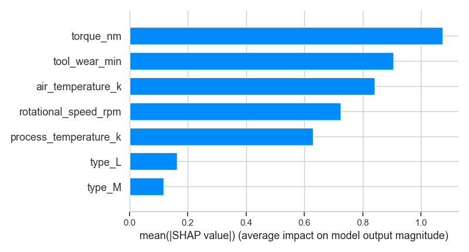

# 🏭 Predictive Maintenance with Machine Learning

A real-world predictive maintenance system built using industrial sensor data, applying classification algorithms and SHAP explainability to predict machine failures before they occur.

---

## 📈 Project Snapshots


### 🔍 SHAP Feature Importance


### 🧠 Top 10 XGBoost Features


### 📊 ROC Curve


### 🤖 Model Comparison


---

## 📖 Detailed Project Walkthrough

This project simulates a **real-world predictive maintenance scenario**, where we’re given historical sensor readings from industrial machines and asked to **predict if a machine is at risk of failure**.

---

### 🧼 Step 1: Data Understanding & Cleaning

We began by loading a dataset containing **10,000 machine records**, each with:

* Continuous sensor readings (temperature, torque, speed, etc.)
* A machine type
* A binary target column (`Target`), indicating if a failure occurred
* Dataset: `10,000` machine logs with real-time telemetry and status flags
* Dropped identifiers (`UDI`, `Product ID`) to avoid leakage
* One-hot encoded `Type` column (machine type)
* Converted all object features to numerical or categorical
* Target: `Target` column indicating failure (binary classification)

We inspected all columns for missing values, incorrect types, or irrelevant data. Two identifier columns (`UDI`, `Product ID`) were dropped to prevent data leakage. One-hot encoding was used to convert the `Type` column into numeric format.

---

### 📊 Step 2: Exploratory Data Analysis (EDA)
* We explored trends and correlations:

* ⚠️ **Highly imbalanced** data (\~2% failure rate), mimicking real industry conditions
* 🧩 `Failure Type` mostly `"No Failure"` → confirmed that `Target` is the modeling label
* 📊 **Correlation analysis**:

  * `Tool Wear`, `Torque`, and `Speed` positively correlated with failure
  * `Air Temp` ↔ `Process Temp` showed multicollinearity
* 🔍 Outlier inspection revealed high-risk wear patterns on failing machines


- The **target variable was extremely imbalanced** (~2% failures), which mirrors real-world industrial settings where most machines operate normally.
- **Failure Type** was often `"No Failure"`, reinforcing that `Target` was the correct column to model.
- Using a **correlation heatmap**, we found that:
  - `Torque` and `Tool Wear` had moderately strong positive correlation with failures.
  - `Air temperature` and `Process temperature` were highly correlated with each other, possibly due to environmental factors.

**Key takeaway:** There are multiple sensor features with predictive potential, and some may interact.

---

### 🤖 Step 3: Model Training (XGBoost)

Used **XGBoostClassifier** — ideal for tabular + imbalanced data

**Evaluation metrics**:

* ✅ Accuracy
* ✅ Precision
* ✅ **Recall** (priority: catching all failures)
* ✅ F1-score
* ✅ AUC-ROC

📌 **Recall stayed high**, meaning the model successfully detected most at-risk machines — crucial in predictive maintenance.

---

### 🧠 Step 4: Model Explainability (SHAP)

We applied **SHAP values** to explain which features drove model predictions.

The SHAP bar plot revealed:

- `Tool Wear`, `Torque`, and `Rotational Speed` were **the most influential** in predicting failure.
- `Tool Wear` consistently pushed predictions toward "Failure", especially at higher values.
- Some `Type` encodings (i.e., machine types) had small but consistent influence.

This aligned with domain intuition — machines that spin faster or operate under higher torque or longer wear time tend to break down.

---

### 🔍 Step 5: Insights & Recommendations

📌 **Engineering Takeaways**:

* Enable real-time dashboards using SHAP to show *why* a machine was flagged
* **Preventive Thresholding**: Monitoring `Tool Wear` and `Torque` over time and triggering alerts at certain thresholds can help prevent unexpected breakdowns.
* **Custom Maintenance per Machine Type**: Some types may need more frequent servicing depending on failure association.
* **Feature Monitoring**: Incorporating SHAP explanations into dashboards can help operators understand *why* a machine was flagged.


---

## 💾 Folder Structure

```
predictive-maintenance/
├── data/
│   └── pdm_dataset.csv
├── outputs/
│   ├── shap_summary_bar.png
│   ├── feature_importance.png
│   └── confusion_matrix.png
├── src/
│   └── preprocessing.py
├── venv/
├── requirements.txt
└── predictive_maintenance.ipynb
```

---

## 🧪 Requirements

```bash
pip install -r requirements.txt
```

Libraries used:

* `pandas`, `numpy`, `matplotlib`, `seaborn`
* `scikit-learn`, `xgboost`, `shap`

---

## 🧠 Why This Project Matters

* 📉 Demonstrates how to handle **imbalanced classification**
* 🛠 Applies **SHAP** for explainability — crucial in enterprise ML
* 🧪 Focused on **reliability + interpretability**, not just raw accuracy
* 🔁 End-to-end workflow: EDA → Modeling → Explainability → Actionable Insights

This project shows I can design trustworthy, interpretable models ready for production use — skills vital in both academic and industry ML environments.

---

## 👩🏽‍💻 About Me

* 🧠 Strong foundation in **Python, Machine Learning, and Data Visualization**
* 🛠️ Building a portfolio of 15+ professional-grade projects
* 📍 Focused on real-world use cases: predictive analytics, explainable AI, optimization
* 🎯 My goal: apply data science to solve complex problems in tech, healthcare, and beyond

> 🔗 [LinkedIn](https://www.linkedin.com/in/alexus-glass-248061237/) | 🐙 [GitHub](https://github.com/lexusimni)

---
